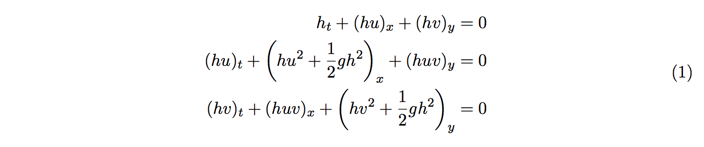
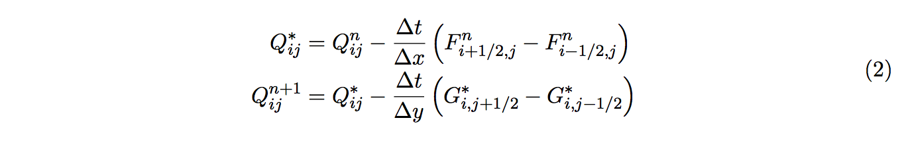
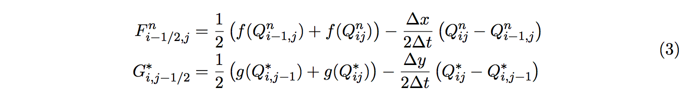

# OpenMP Advanced project

## About this exercise

The aim of this exercise is to give hands-on experience in parallelizing a
larger program, measure parallel performance and gain experience in what to
expect from modern multi-core architectures and accelerators.

Your task is to parallelize a finite-volume solver for the two dimensional
shallow water equations. Measure speedup and if you have time, tune the code.
You don’t need to understand the numerics in order to solve this exercise (a
short description is given in Appendix A). However, it assumes some prior
experience with OpenMP, please refer to the lecture on shared memory
programming if necessary.

## Algorithm

For this exercise we solve the shallow water equations on a square domain using
a simple dimensional splitting approach. Updating volumes Q with numerical
fluxes F and G, first in the x and then in the y direction, more easily
expressed with the following pseudo-code

```
for each time step do
    Apply boundary conditions
    for each Q do
        Calculate fluxes F in the x-direction
        Update volume Q with fluxes F
    end
    for each Q do
        Calculate fluxes G in the y-direction
        Update volumes Q with fluxes G
    end
end
```

### 1. Establish a performance baseline

Compile and run the given OpenMP version (shwater2d_cpu.f90) on various numbers of threads and note down the fastest runtime.

### 2. GPU Acceleration

Use the given OpenMP version as a baseline and implement a new version for GPUs based on OpenMP offloading. Is it faster than the CPU version? If not, try to optimize the code by removing memory transfers, trying different work-sharing constructs, etc. 

### 3. Final performance evaluation

Increase the problem size for both the CPU and GPU versions of the code and rerun the performance measurements. Does it change which version is faster?

### Debugging

For debugging purposes you might want to visualize the computed solution.
Uncomment the line ``save_vtk``. The result will be stored in ``result.vtk``, which can
be opened in ParaView, available on Tegner after 
``module add paraview``. Beware that the resulting file could be rather large,
unless the space discretization (M,N) is decreased.

### A. About the Finite-Volume solver

In this exercise we solve the shallow water equations in two dimensions given
by 



where _h_ is the depth and (_u_,_v_) are the velocity vectors. To solve the equations
we use a dimensional splitting approach, i.e. reducing the two dimensional problem
to a sequence of one-dimensional problems



For this exercise we use the Lax-Friedrich’s scheme, with numerical fluxes _F_, _G_
defined as



where _f_ and _g_ are the flux functions, derived from (1). For simplicity we use
reflective boundary conditions, thus at the boundary


